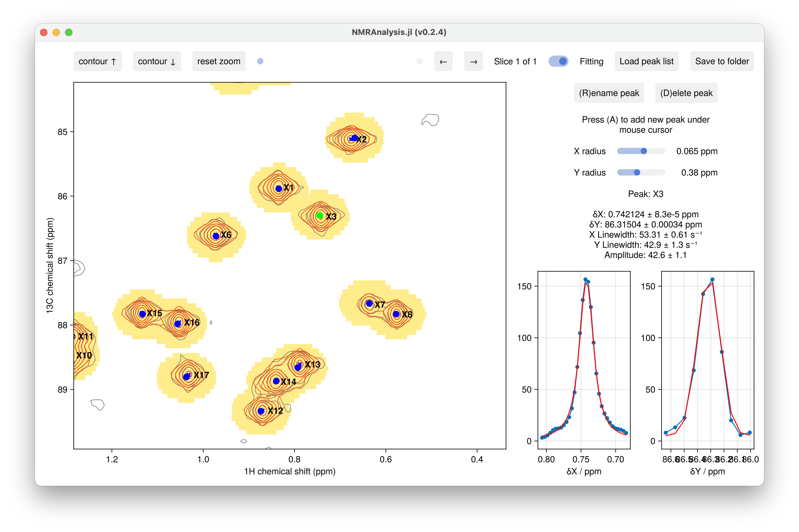
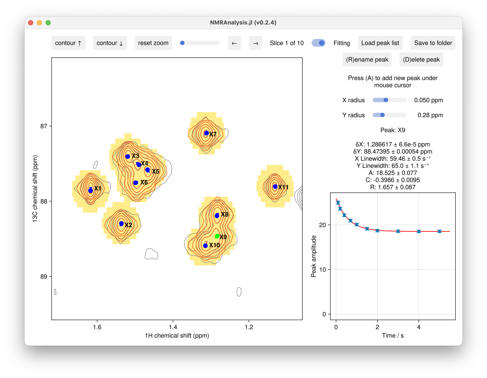

# 2D Fitting

## Usage Example

```julia
using NMRAnalysis

# Analyze T2 relaxation data from multiple processed spectra
relaxation2d(
    ["expno/pdata/231",  # First spectrum
     "expno/pdata/232",  # Second spectrum
     "expno/pdata/233"], # Third spectrum
    [0.01, 0.03, 0.05]   # Relaxation delays in seconds
)

# Analyze hetNOE data from reference/saturated pair
hetnoe2d(
    ["reference/pdata/1",
     "saturated/pdata/1"],
    [false, true]            # saturation status
)

# Single plane peak fitting
intensities2d("109/pdata/23")
```



```julia
t=[0.1, .2, .4, .7, 1, 1.5, 2,3,4,5]
recovery2d("33",t)
```




## Interactive Analysis

The 2D analysis functions provide an interactive GUI for:
- Peak picking
- Fitting
- Visual validation
- Data export

## Output

All analysis functions provide:
- Fitted parameters with uncertainties
- Publication-quality figures
- Options to save results

