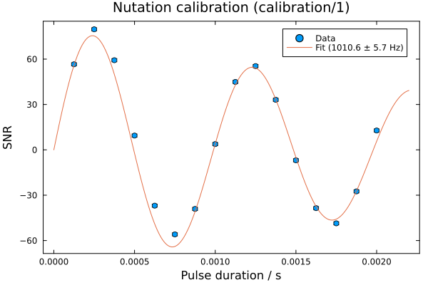

# 1D Calibration Analysis

The calibration analysis module in NMRAnalysis.jl provides tools for analyzing pulse calibration experiments. These experiments are essential for determining accurate pulse lengths and power levels before running relaxation or other quantitative NMR experiments.

## The `analyse` Function

NMRAnalysis.jl provides a generic `analyse()` function that automatically detects experiment types based on pulse sequence annotations and dispatches to the appropriate analysis routine.

```julia
using NMRAnalysis
analyse("path/to/experiment")
```

The function reads metadata from the NMR experiment to determine:
- **Experiment type**: e.g., "1d", "calibration"
- **Features**: e.g., "nutation"

Based on these annotations, it calls the appropriate analysis function automatically.

## 19F Nutation Calibration

Nutation experiments measure the B1 field strength by varying the pulse duration and observing the resulting oscillation in signal intensity. This is particularly useful for calibrating spinlock powers in R1rho experiments.

### Pulse Program

The pulse program for 19F nutation calibration is available at:

- **[`19f_calib_nut.cw`](https://waudbylab.org/pulseprograms/sequences/19f_calib_nut.cw/)**

This sequence includes annotations that enable automatic analysis by NMRAnalysis.jl.

### Example Usage

To analyse a nutation calibration experiment:

```julia
using NMRAnalysis
analyse("examples/calibration/1")
```

This produces console output with the calibration results:

```
[ Info: Analysing calibration by nutation on examples/calibration/1
[ Info:  - Power level: 16.997737581326444 dB
[ Info:  - Nutation frequency ν₁: 1010.6 ± 5.7 Hz
[ Info:  - 90° pulse length: 247.4 ± 1.4 μs
[ Info:  - Decay rate: 327.0 ± 69.0 s⁻¹
[ Info:  - B₁ inhomogeneity (R/2πν₁): 5.1 ± 1.1 %
```

A plot is also displayed showing the nutation data and fit:



### Return Value

The function returns a named tuple containing:

| Field | Description |
|-------|-------------|
| `pulse90` | 90° pulse duration in seconds (with uncertainty) |
| `nut_hz` | Nutation frequency in Hz (with uncertainty) |
| `power_level` | Power level used in the experiment |
| `plt` | Plot object showing data and fit |

```julia
julia> result = analyse("examples/calibration/1")
(pulse90 = 0.0002474 ± 1.4e-6, nut_hz = 1010.6 ± 5.7, power_level = Power(16.997737581326444 dB, 0.019963019999999998 W), plt = Plot{Plots.GRBackend() n=2})
```

## Required Pulse Sequence Annotations

For automatic analysis, the pulse sequence must include the following annotations:

| Annotation | Description |
|------------|-------------|
| `calibration.channel` | Channel to use for calibration (e.g., "f1") |
| `calibration.power` | Power level used in the experiment |
| `calibration.duration` | Array of pulse durations used |
| `calibration.model` | Model to fit: `"sine_modulated"` or `"cosine_modulated"` |

### Optional Annotations

| Annotation | Description |
|------------|-------------|
| `calibration.offset` | Offset in ppm to select the observed signal (default: 0.0) |

## Theoretical Background

### Nutation Model

The nutation experiment measures signal intensity as a function of pulse duration. For a pulse applied on-resonance, the signal follows a damped oscillation:

**Sine-modulated** (starting from equilibrium):
```math
I(t) = A \cdot \sin(2\pi \nu_1 t) \cdot \exp(-R \cdot t)
```

**Cosine-modulated** (starting from transverse magnetization):
```math
I(t) = A \cdot \cos(2\pi \nu_1 t) \cdot \exp(-R \cdot t)
```

Where:
- ``\nu_1`` is the nutation frequency (B1 field strength in Hz)
- ``R`` is the decay rate due to B1 inhomogeneity and relaxation
- ``A`` is the amplitude

### Calculated Parameters

From the fitted nutation frequency, the 90° pulse length is calculated as:

```math
t_{90} = \frac{1}{4 \nu_1}
```

The B1 inhomogeneity is estimated from the ratio of the decay rate to the nutation frequency:

```math
\text{B}_1 \text{ inhomogeneity} = \frac{R}{2\pi \nu_1}
```

A typical B1 inhomogeneity of 5-10% is expected for standard NMR probes.

## Integration with R1rho Experiments

Calibration experiments can be used directly with `setupR1rhopowers()` to calculate spinlock power levels. See the [R1rho tutorial](../tutorials/r1rho.md) for details.

```julia
setupR1rhopowers("examples/calibration/1")
```
