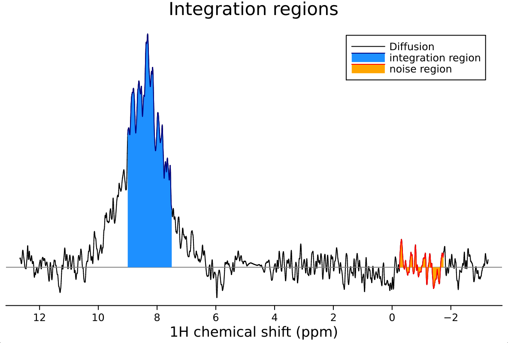
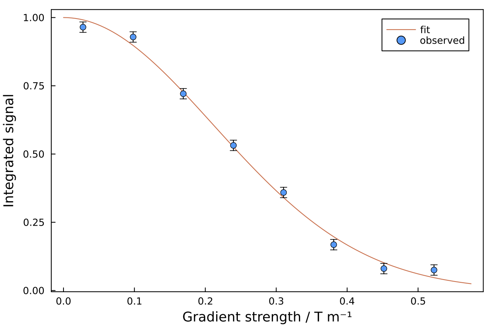

# 1D Diffusion Analysis

The diffusion analysis module in `NMRAnalysis.jl` provides a basic tool for analyzing diffusion-ordered spectroscopy (DOSY) experiments. This analysis determines the translational diffusion coefficient of molecules and estimates their hydrodynamic radius using the Stokes-Einstein relation.

## Launching Diffusion Analysis

To launch the analysis of a diffusion experiment, specify the experiment folder number:

```julia
using NMRAnalysis
diffusion("106")
```

If no folder is given, you will be prompted to enter a path.

## Analysis Workflow

### 1. Parameter Confirmation

When you launch the analysis, the program will parse the experiment parameters and ask you to confirm or correct them:

```
Parsing experiment parameters...
Gradient pulse length δ = 4000.0 μs (2*p30). Press enter to confirm or type correct value (in μs): 
Diffusion delay Δ = 0.1 s (d20). Press enter to confirm or type correct value (in s): 
Gradient shape factor σ = 0.9 (gpnam6 = SMSQ10.100). Press enter to confirm or type correct value: 
Max. gradient strength Gmax = 0.55 T m⁻¹ (typical value for Bruker systems). Press enter to confirm or type correct value (in T m⁻¹): 
Enter initial gradient strength (%): 5
Enter final gradient strength (%): 95
Enter gradient ramp type ('l' / 'q' / 'e'): l
```

!!! note "Gradient List Parameters"
    Parameters about the gradient list (initial/final gradient strengths and ramp type) are not saved in Bruker systems. You need to maintain a record of the starting and finishing gradient strengths and how points are arranged - this matches the `dosy` TopSpin dialog.

### 2. Integration Region Selection

A spectrum plot will be displayed, and you'll be asked to define the integration region and noise estimation area:

```
Defining integration region - please enter first chemical shift: 7.5
Defining integration region - please enter second chemical shift: 9
Enter a chemical shift in the center of the noise region: -1
```

### 3. Visual Confirmation

The program displays the selected integration and noise regions for confirmation:

```
Displaying integration and noise regions. Press enter to continue.
```



### 4. Fitting and Results

After pressing enter, the fit runs automatically using the Stejskal-Tanner equation. Results are displayed in the terminal while a fit plot is shown:



```
[ Info: Viscosity: calculation based on Cho et al, J Phys Chem B (1999) 103 1991-1994

┌ Info: diffusion results
│ 
│ Current directory: /Users/chris/NMR/crick-702/kleopatra_231201_CRT_GSG_C163S
│ Experiment: 106/pdata/1
│ 
│ Integration region: 7.5 - 9.0 ppm
│ Noise region: -1.75 - -0.25 ppm
│ 
│ Solvent: h2o
│ Temperature: 298.1992 K
│ Expected viscosity: 0.8892568047202338 mPa s
│ 
│ Fitted diffusion coefficient: 1.248e-10 ± 4.0e-12 m² s⁻¹
└ Calculated hydrodynamic radius: 19.67 ± 0.62 Å
```

### 5. Saving Results

Finally, you can save the fit figure:

```
Enter a filename to save figure (press enter to skip): diffusion-fit.png
Figure saved to diffusion-fit.png.
```

The file format is automatically chosen based on the extension (e.g., `.png` or `.pdf`).

## Theoretical Background

### Stejskal-Tanner Equation

Experiments are fitted to the Stejskal-Tanner equation with finite gradient length correction:

```math
I(g) = I_0 \cdot \exp \left( -\left[ \gamma\delta\sigma g G_\mathrm{max} \right] ^2 \left[\Delta - \delta/3 \right] D \right)
```

Where:
- ``I(g)`` is the signal intensity at gradient strength ``g``
- ``I_0`` is the initial signal intensity
- ``\gamma`` is the gyromagnetic ratio
- ``\delta`` is the gradient pulse length
- ``\sigma`` is the gradient shape factor (0.9 for trapezoidal gradients)
- ``G_\mathrm{max}`` is the maximum gradient strength
- ``\Delta`` is the diffusion delay
- ``D`` is the diffusion coefficient

### Hydrodynamic Radius Calculation

The hydrodynamic radius ``r_h`` is calculated using the Stokes-Einstein relation:

```math
D = \frac{kT}{6\pi \eta r_h}
```

Where:
- ``k`` is the Boltzmann constant
- ``T`` is the temperature
- ``\eta`` is the dynamic viscosity

The viscosity is estimated based on solvent type and temperature using the formula from Cho et al., J. Phys. Chem. B (1999) 103, 1991-1994.

## Noise Estimation

Noise levels for peak integrals are calculated by integrating a matching region of noise and taking the standard deviation across diffusion gradient strengths. This approach relies on good quality baselines for accurate noise estimation.
