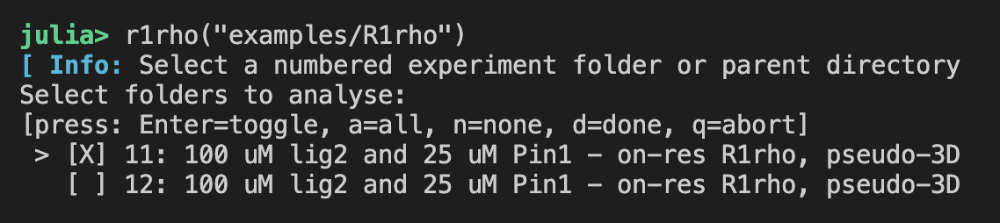
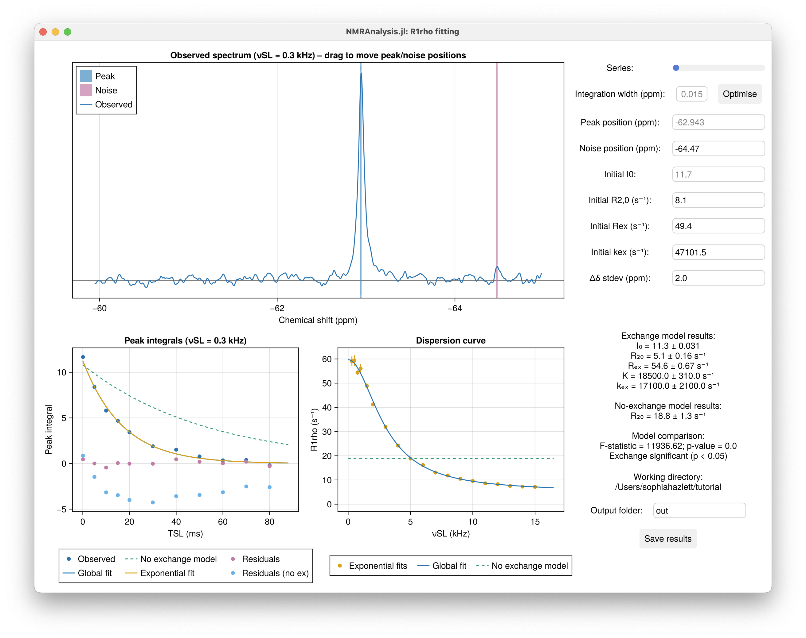

# 1D R1ρ Analysis

The `R1rho` module in NMRAnalysis.jl provides a graphical interface for the analysis of one-dimensional R1ρ relaxation dispersion experiments. This GUI allows you to load, visualize, and fit R1ρ data interactively.

## Launching the R1ρ GUI

You can launch the R1ρ analysis GUI in several ways, depending on your workflow and data organization:

### 1. Launch with a Selection Dialog

If you call `r1rho()` with no arguments, a dialog will appear allowing you to select a directory containing your NMR experiments.

```julia
using NMRAnalysis
r1rho()
```

### 2. Launch with a Starting Folder

You can provide a starting folder as an argument. The program will display a list of available NMR experiments in the terminal for you to select.

```julia
r1rho("example/R1rho")
```



### 3. Launch with a List of Specific Input Spectra

You can also provide a list of specific experiment folders or files for direct analysis.

```julia
r1rho(["example/R1rho/11", "example/R1rho/12"])
```



## Filtering spin-lock strengths: `minvSL` and `maxvSL`

In on-resonance R1ρ experiments, very low spin-lock strengths can result in poor magnetization alignment, often observed as oscillations in the decay curves. Conversely, very high spin-lock strengths may introduce artifacts due to detuning. To improve the robustness of your analysis, you can use the `minvSL` and `maxvSL` keyword arguments to exclude problematic spin-lock strengths from the fit.

- `minvSL`: Exclude spin-lock strengths below this value (in Hz). The default lower limit is 250 Hz.
- `maxvSL`: Exclude spin-lock strengths above this value (in Hz). By default, there is no upper limit.

For example, to exclude spin-lock strengths below 500 Hz and above 10 kHz:

```julia
r1rho(["example/R1rho/11", "example/R1rho/12"], minvSL=500, maxvSL=10_000)
```

Or, when launching with a dialog:

```julia
r1rho(minvSL=800)  # Exclude all spin-locks below 800 Hz
```

Filtering in this way helps ensure that only reliable data are included in the fit, improving the robustness of your analysis.

## Adjusting the Display Size: `scalefactor`

The GUI display size can be adjusted using the optional `scalefactor` keyword argument. By default, this is set to `:automatic`, which uses a value of `2` for high-resolution (HiDPI/Retina) displays and `1` for standard displays. You can override this by specifying a numeric value:

```julia
r1rho(scalefactor=1.5)  # Scale the display by 1.5x
```

!!! tip
    If the interface is too crowded for your screen size, try running with a lower scale factor.

## Example Usage

```julia
# Launch with dialog
r1rho()

# Launch with a specific folder
r1rho("data/R1rho_experiments")

# Launch with a list of experiments and custom scale
r1rho(["data/R1rho/11", "data/R1rho/12"], scalefactor=1.5)
```

## Citation

* Hazlett, Harvey, Davis and Waudby (preprint). Kinetic NMR screening: rapidly quantifying fast ligand dissociation in fragment mixtures using 19F relaxation dispersion. https://chemrxiv.org/doi/full/10.26434/chemrxiv-2025-vt1wg.
