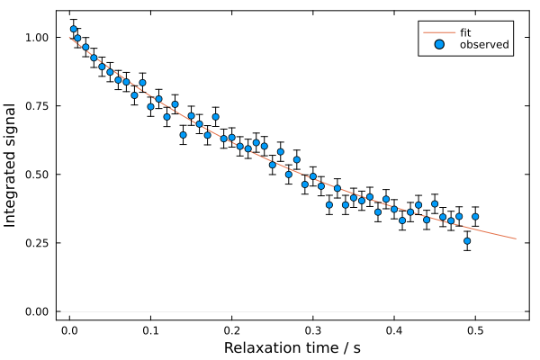

# 1D Relaxation Analysis

The relaxation analysis module in NMRAnalysis.jl provides a basic tool for analyzing R1 and R2 measurements, fitting either to exponential decays or to an inversion-recovery model.

## Launching Relaxation Analysis

Use `relaxation()` to launch the analysis of a relaxation experiment.

```julia
using NMRAnalysis

relaxation()                                    # prompt for experiment folder and experiment type
relaxation("examples/relaxation/1")             # specify experiment folder, prompt for experiment type
relaxation("examples/relaxation/2", ir=true)    # use inversion-recovery model
relaxation("examples/relaxation/3",
    [0.001, 0.002, 0.004, 0.006, 0.010, 0.015, 0.020, 0.030, 0.050],
    ir=false)                                   # give relaxation times manually, use exponential fit
```

- If no folder is given, you will be prompted to enter a path
- You can use the `ir=true/false` option to directly specify which model to use
- You can provide a list of relaxation times - otherwise these will be parsed from a vclist or vdlist

## Analysis Workflow

### 1. Parameter Confirmation

When you launch the analysis, the program will parse the experiment parameters and ask you to confirm or correct them:

```
Current directory: /Users/chris/git/NMRAnalysis.jl

Enter path to relaxation experiment (i.e. Bruker experiment folder): examples/relaxation/T2
Enter 'IR' for inversion-recovery otherwise press ENTER: 
```

If a `vclist` file is used, you will be asked to specify the conversion factor to relaxation times:

```
Found vclist in acqus. Please enter milliseconds per loop: 
```

### 2. Integration Region Selection

A spectrum plot will be displayed, and you'll be asked to define the integration region and noise estimation area:

```
Defining integration region - please enter first chemical shift: -61.6
Defining integration region - please enter second chemical shift: -61.7
Enter a chemical shift in the center of the noise region: -200
```

The program then displays the selected integration and noise regions for confirmation:

### 3. Fitting and Results

After pressing enter, the fit runs automatically. Results are displayed in the terminal while a fit plot is shown:



```
┌ Info: Relaxation results
│ 
│ Current directory: /Users/chris/git/NMRAnalysis.jl
│ Experiment: examples/relaxation/T2/pdata/1
│ 
│ Integration region: -61.7 - -61.6 ppm
│ Noise region: -200.05 - -199.95 ppm
│ 
│ Fitted relaxation rate: 2.415 ± 0.058 s⁻¹
└ Fitted relaxation time: 0.4141 ± 0.0099 s
```

Fits to the inversion recovery model will also report the amplitude of the recovery phase.


```
┌ Info: Relaxation results
│ 
│ Current directory: /Users/chris/git/NMRAnalysis.jl
│ Experiment: examples/relaxation/ir/pdata/1
│ 
│ Integration region: 1.0 - 2.0 ppm
│ Noise region: -2.5 - -1.5 ppm
│ 
│ Fitted relaxation rate: 0.93 ± 0.071 s⁻¹
│ Fitted relaxation time: 1.075 ± 0.082 s
└ Inversion-recovery amplitude: 1.759 ± 0.059
```


### 4. Saving Results

Finally, you can save the fit figure:

```
Enter a filename to save figure (press enter to skip): relaxation-fit.png
Figure saved to relaxation-fit.png.
```

The file format is automatically chosen based on the extension (e.g., `.png` or `.pdf`).


## Noise Estimation

Noise levels for peak integrals are calculated by integrating a matching region of noise and taking the standard deviation across diffusion gradient strengths. This approach relies on good quality baselines for accurate noise estimation.
