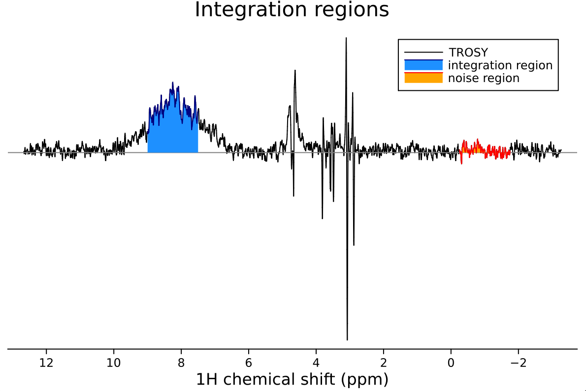
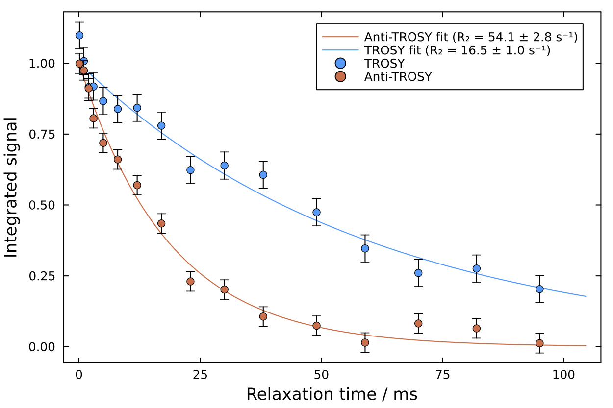

# 1D TRACT Analysis

The TRACT (TROSY for Rotational Correlation Times) analysis module in NMRAnalysis.jl provides tools for determining effective rotational correlation times (τc) of proteins from NMR relaxation interference. TRACT experiments measure the difference in relaxation rates between TROSY and anti-TROSY components to estimate molecular tumbling rates.

## What TRACT Measures

TRACT experiments exploit the relaxation interference between dipolar and chemical shift anisotropy (CSA) mechanisms in ¹⁵N-¹H spin systems. The TROSY effect results from the partial cancellation of these relaxation mechanisms, while the anti-TROSY component experiences their reinforcement. By measuring both relaxation rates and calculating their difference (ΔR₂), TRACT provides a simple way to estimate effective rotational correlation times.

This technique is particularly valuable for:
- Large proteins and protein complexes where conventional relaxation measurements become challenging
- Systems where rapid data acquisition is essential
- Obtaining global tumbling information without detailed relaxation analysis

## Launching TRACT Analysis

To launch TRACT analysis, call the function without arguments:

```julia
using NMRAnalysis
tract()
```

## Analysis Workflow

### 1. Experiment Selection

The program will prompt you to specify the paths to your TROSY and anti-TROSY experiments:

```
Current directory: /Users/chris/NMR/crick-702/my_dataset

Enter path to TROSY experiment (i.e. Bruker experiment folder): 12
Enter path to anti-TROSY experiment: 13
```

### 2. Integration Region Selection

You'll be asked to define the integration region and noise estimation area:

```
Defining integration region - please enter first chemical shift: 7.5
Defining integration region - please enter second chemical shift: 9
Enter a chemical shift in the center of the noise region: -1
```

### 3. Visual Confirmation

The program displays the selected integration and noise regions for both experiments:

```
Displaying integration and noise regions. Press enter to continue.
```



### 4. Fitting and Results

After confirmation, the analysis proceeds automatically. The program fits exponential decays to both TROSY and anti-TROSY data and calculates the effective rotational correlation time:



```
┌ Info: TRACT results
│ 
│ Current directory: /Users/chris/NMR/crick-702/kleopatra_231201_CRT_GSG_C163S
│ TROSY experiment: 12/pdata/1
│ Anti-TROSY experiment: 13/pdata/1
│ 
│ Integration region: 7.5 - 9.0 ppm
│ Noise region: -1.75 - -0.25 ppm
│ 
│ Fitted TROSY relaxation rate: 16.5 ± 1.0 s-1
│ Fitted anti-TROSY relaxation rate: 54.1 ± 2.8 s-1
│ 
│ Estimated τc: 15.5 ± 1.3 ns
│ 
└ N.B. TRACT analysis assumes the protein is perfectly rigid. In the presence of flexibility or disorder, reported τc values will be underestimates.
```

### 5. Saving Results

Finally, you can save the fit figure:

```
Enter a filename to save figure (press enter to skip): tract-fit.pdf
Figure saved to tract-fit.pdf.
```

The file format is automatically chosen based on the extension (e.g., `.png` or `.pdf`).

## Theoretical Background

### Relaxation Interference Theory

TRACT analysis exploits the interference between dipolar and CSA relaxation mechanisms in ¹⁵N-¹H spin systems. The key relationship is:

```math
\begin{aligned}
\Delta R_2 &= R_{2,\mathrm{anti-TROSY}} - R_{2,\mathrm{TROSY}} \\
\eta_{xy} &= \Delta R_2 / 2
\end{aligned}
```

Where:
- ``\Delta R_2`` is the difference in transverse relaxation rates
- ``η_{xy}`` is the cross-correlation rate between dipolar and CSA mechanisms
- ``R_{2,\mathrm{TROSY}}`` and ``R_{2,\mathrm{anti-TROSY}}`` are the fitted relaxation rates

### Rotational Correlation Time Calculation

The effective rotational correlation time is calculated from the analytical solution:

```math
\eta_{xy} = \frac{2}{5} \cdot \frac{\mu_0 \gamma_N \gamma_H \hbar}{4\pi r_{NH}^3} \cdot \frac{\omega_N \Delta\sigma}{3} \cdot \left[4\tau_c + \frac{3\tau_c}{1 + \omega_N^2\tau_c^2} \right]
```

Where:
- ``\mu_0`` is the permeability of free space
- ``\gamma_H``, ``\gamma_N`` are the gyromagnetic ratios
- ``\hbar`` is the reduced Planck constant
- ``r_{NH}`` is the N-H bond length (typically 1.02 Å)
- ``\omega_N`` is the nitrogen-15 Larmor frequency
- ``\Delta\sigma`` is the ¹⁵N chemical shift anisotropy (-160 ppm)
- ``\tau_c`` is the (effective) rotational correlation time

### Assumptions and Limitations

TRACT assumes isotropic tumbling of a perfectly rigid molecule. Internal motions and conformational flexibility will lead to underestimated τc values.

## Noise Estimation

Uncertainties in relaxation rates are derived from noise analysis of the integration regions. The noise level is calculated by integrating a matching region of noise and determining the standard deviation across the relaxation delay series. Uncertainty propagation through the τc calculation provides the final error estimate.

## Citation

* Lee, D., Hilty, C., Wider, G., & Wüthrich, K. (2006). Effective rotational correlation times of proteins from NMR relaxation interference. *Journal of Magnetic Resonance*, **178**, 72-76. doi: 10.1016/j.jmr.2005.08.014
