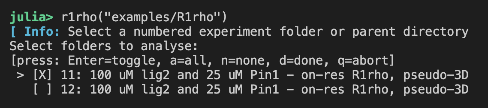

# R1ρ Analysis

The `R1rho` module in NMRAnalysis.jl provides a graphical interface for the analysis of one-dimensional R1ρ relaxation dispersion experiments. This GUI allows you to load, visualize, and fit R1ρ data interactively.

## Launching the R1ρ GUI

You can launch the R1ρ analysis GUI in several ways, depending on your workflow and data organization:

### 1. Launch with a Selection Dialog

If you call `r1rho()` with no arguments, a dialog will appear allowing you to select a directory containing your NMR experiments.

```julia
using NMRAnalysis
r1rho()
```

### 2. Launch with a Starting Folder

You can provide a starting folder as an argument. The program will display a list of available NMR experiments in the terminal for you to select.

```julia
r1rho("example/R1rho")
```



### 3. Launch with a List of Specific Input Spectra

You can also provide a list of specific experiment folders or files for direct analysis.

```julia
r1rho(["example/R1rho/11", "example/R1rho/12"])
```

## GUI Overview 

Once launched, the GUI displays the first spectrum of the dataset. 


- **Series Toggle**: Navigate between measurements at different spin-lock field strengths.
- **Integration Width**: Manually input an integration width, or select **Optimise**  to automatically adjust the integration width to minimize fititng error.
- **Peak position (ppm)**: Automatically set to the chemical shift of the ligand; can be manually adjusted if needed.
- **Noise position (ppm)**: Automatically placed at a distance from the peak; adjust as ncessary. 
- **Initial Guesses**: Provide starting values for `R2,0`, `Rex`, and `kex` to guide the fitting model.
- **Δδ stdev (ppm)**: Accounts for the unknown chemical shift difference between free and bound states. We assume a normal distribution centered at zero with a standard deviation of 2 ppm.
- **Output folder**: Specify a name for your results folder to keep outputs organised.
- **Save Results**: Click to export fitted paramaters and plots to your output folder.

## Analysis Workflow

### 1. Visualize the Spectrum

- The top plot displays the observed spectrum at a given spin-lock field strength (vSL).
- Peak and noise positions are as indicated on the spectra.
- Adjust the **Integration Width** to define the region used for peak fitting.

### 2. Fit the Data

- Use **Optimise** to refine the integration width automatically.
- Input initial guesses for model parameters:
  - `R2,0`: transverse relaxation rate
  - `Rex`: exchange conttribution to relaxation rate
  - `kex`: exchange rate constant
- The data is automatically fit.

### 3. Interpret the Results

- **Peak Integrals Plot**: 
    - Signal intensities are fit globally as a function of relaxation time and field strength to
    $$
        I(T_{\text{SL}}, \nu_{\text{SL}}) = I_0 \cdot \exp\left(-\left[R_{2,0} + \frac{R_{\text{ex}} \cdot K^2}{K^2 + 4\pi^2 \nu_{\text{SL}}^2}\right] \cdot T_{\text{SL}}\right)
    $$
    
    *Adapted from Trott & Palmer (2002), J. Magn. Reson. 154, 157–160.* 

    where 
    
    $$
        K^2 = k_{\text{ex}}^2 + 4\pi^2 \Delta\nu^2
    $$

    - To assess if the exchange contribution is statistically significant, a null model is also fitted excluding exchange and compared using an F-test.

- **Dispersion Curve**:
  - R1ρ is plotted as a function of νSL using fitted parameters overlaid with R1ρ relaxation rates determined by fits of signal intensities to exponential decays at  individual spinlock field strengths.  

$$
R_{1\rho} = R_{2,0} + \frac{R_{\text{ex}} \cdot K^2}{K^2 + 4\pi^2 \nu_{\text{SL}}^2}
$$


## Filtering spin-lock strengths: `minvSL` and `maxvSL`

In on-resonance R1ρ experiments, very low spin-lock strengths can result in poor magnetization alignment, often observed as oscillations in the decay curves. Conversely, very high spin-lock strengths may introduce artifacts due to detuning. To improve the robustness of your analysis, you can use the `minvSL` and `maxvSL` keyword arguments to exclude problematic spin-lock strengths from the fit.

- `minvSL`: Exclude spin-lock strengths below this value (in Hz). The default lower limit is 250 Hz.
- `maxvSL`: Exclude spin-lock strengths above this value (in Hz). By default, there is no upper limit.

For example, to exclude spin-lock strengths below 500 Hz and above 10 kHz:

```julia
r1rho(["example/R1rho/11", "example/R1rho/12"], minvSL=500, maxvSL=10_000)
```

Or, when launching with a dialog:

```julia
r1rho(minvSL=800)  # Exclude all spin-locks below 800 Hz
```

Filtering in this way helps ensure that only reliable data are included in the fit, improving the robustness of your analysis.

## Adjusting the Display Size: `scalefactor`

The GUI display size can be adjusted using the optional `scalefactor` keyword argument. By default, this is set to `:automatic`, which uses a value of `2` for high-resolution (HiDPI/Retina) displays and `1` for standard displays. You can override this by specifying a numeric value:

```julia
r1rho(scalefactor=1.5)  # Scale the display by 1.5x
```

!!! tip
    If the interface is too crowded for your screen size, try running with a lower scale factor.

## Example Usage

```julia
# Launch with dialog
r1rho()

# Launch with a specific folder
r1rho("data/R1rho_experiments")

# Launch with a list of experiments and custom scale
r1rho(["data/R1rho/11", "data/R1rho/12"], scalefactor=1.5)
```

## Citation

*Placeholder for the associated publication. Please insert citation details here.*
