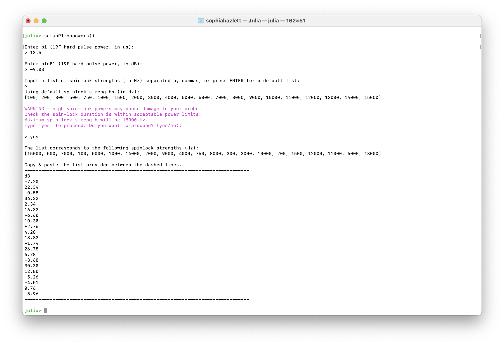
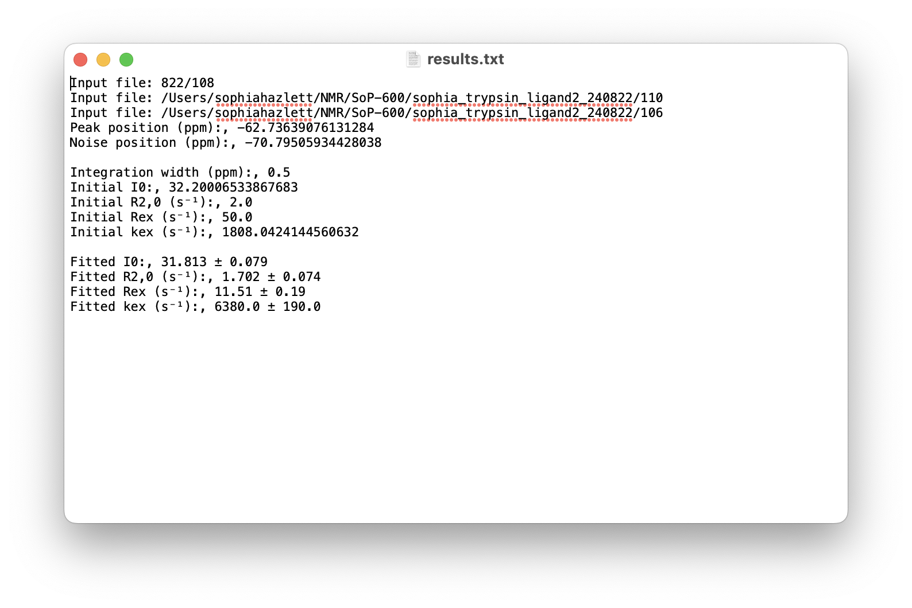

# Tutorial: R1ρ Analysis

This tutorial walks through the graphical interface for analysing R1ρ relaxation dispersion data. It covers experimental setup, GUI controls, fitting workflow, and interpretation of results.

## Experimental Setup 

### 1. Determine the Ligand Chemical Shift

Acquire a 1D broadband ``^{19}``F NMR experiment to identify the chemical shift of the ligand resonance. This value will serve as the O1 in the 90° pulse calibration experiment. Ensure that the pulse length (`p1`) is set appropriately in subsequent ``R_{1\rho}`` experiments.

### 2. Pulse Program

The pulse program used for on-resonance ``R_{1ρ}`` experiments is available on GitHub:

- **[`19F_onresR1p.cw`](https://github.com/chriswaudby/pp/blob/master/19F_onresR1p.cw)**  

This sequence is adapted from Overbeck et al. (J. Magn. Reson. 2020, **74**, 753–766) and includes improved temperature compensation. It supports pseudo-3D acquisition with variable spinlock lengths and powers, read in via `VPLIST` and `VALIST`.

> Make sure to calibrate your hard pulse and spinlock powers before running the sequence. See the calibration section below for details.

### 3. Calibrate Spinlock Powers

NMRAnalysis.jl provides the function `setupR1rhopowers()` for calculating spinlock powers. This function can either accept manual input of pulse parameters or automatically extract them from a calibration experiment.

#### Option A: Using a Calibration Experiment (Recommended)

The simplest approach is to provide a path to a nutation calibration experiment. The pulse parameters will be extracted automatically:

```julia
setupR1rhopowers("examples/calibration/1")
```

This first analyses the calibration experiment and then prompts for spinlock strengths:

```
[ Info: Analysing calibration by nutation on examples/calibration/1
[ Info:  - Power level: 16.997737581326444 dB
[ Info:  - Nutation frequency ν₁: 1010.6 ± 5.7 Hz
[ Info:  - 90° pulse length: 247.4 ± 1.4 μs
[ Info:  - Decay rate: 327.0 ± 69.0 s⁻¹
[ Info:  - B₁ inhomogeneity (R/2πν₁): 5.1 ± 1.1 %

Input a list of spinlock strengths (in Hz) separated by commas, or press ENTER for a default list (100-15000 Hz):
>
Using default spinlock strengths (in Hz):
[100, 200, 300, 500, 750, 1000, 1500, 2000, 3000, 4000, 5000, 6000, 7000, 8000, 9000, 10000, 11000, 12000, 13000, 14000, 15000]

WARNING - high spin-lock powers may cause damage to your probe!
Check the spin-lock duration is within acceptable power limits.
Maximum spin-lock strength will be 15000 Hz.
Type 'yes' to proceed. Do you want to proceed? (yes/no):

> yes

The list corresponds to the following spinlock strengths (Hz):
[14000, 12000, 8000, 4000, 15000, 200, 13000, 10000, 1000, 2000, 11000, 1500, 9000, 5000, 100, 750, 3000, 300, 500, 6000, 7000]

Copy & paste the list provided between the dashed lines.
--------------------------------------------------------------------------------------------------------------------------------------------------------------------------------
dB
-5.83
-4.49
-0.97
5.05
-6.43
31.07
-5.19
-2.91
17.09
11.07
-3.74
13.57
-2.00
3.11
37.09
19.59
7.55
27.55
23.11
1.53
0.19
--------------------------------------------------------------------------------------------------------------------------------------------------------------------------------
```

See the [Calibration documentation](../analyses/calibration.md) for details on acquiring nutation calibration experiments.

#### Option B: Manual Input

Alternatively, call `setupR1rhopowers()` without arguments to enter pulse parameters manually:

```julia
setupR1rhopowers()
```

You will be prompted to enter:
- P1 value for the ``^{19}``F hard pulse (in μs)
- PLdB1 (``^{19}``F hard pulse power in dB)

#### Notes

- You may supply a custom list of spinlock strengths (in Hz), or use the default set provided.
- For high spinlock powers (>10 kHz), a warning will be issued to verify that the spinlock duration remains within acceptable power limits.
- The output is a list of calibrated spinlock powers (in dB) that can be copied directly into VALIST in TopSpin.
- The list is shuffled to avoid systematic errors from sample heating.



## GUI Overview

### Example Data

Example R1ρ data is available for download: [example-R1rho.zip](../assets/example-R1rho.zip)

This dataset contains two experiments (11 and 12) that should be analysed together, as they contain different spinlock strengths. Extract the zip file and use the extracted directory path in the examples below.

### Launching the Interface

Open a Julia session in the terminal and launch the analysis interface:

```julia
using NMRAnalysis

# prompt to select experiments
r1rho()

# provide path to directory containing experiments
r1rho("example/R1rho")

# provide path to specific experiments
r1rho(["example/R1rho/11", "example/R1rho/12"])
```

 Once loaded, the GUI displays the first spectrum of the dataset.


- **Series Toggle**: Switch between measurements at different spin-lock field strengths.
- **Integration Width**: Manually input a value or click **Optimise** to automatically minimize fitting error.
- **Peak Position (ppm)**: Automatically set to the chemical shift of a ligand; manually adjust accordingly if analysing a mixture.
- **Noise Position (ppm)**: Automatically placed away from the peak; adjust if baseline noise is misestimated.
- **Initial Guesses**: Provide starting values for ``R_{2,0}``, ``R_\mathrm{ex}``, and ``k_\mathrm{ex}`` to guide model fitting.
- **Δδ stdev (ppm)**: Accounts for uncertainty in the chemical shift difference between free and bound states. Assumes a normal distribution centered at 0 ppm with a standard deviation of 2 ppm.
- **Output Folder**: Specify a name for your results folder to keep outputs organised.
- **Save Results**: Export fitted parameters and plots to the output folder.

## Analysis Workflow

### 1. Visualise the Spectrum

- The top panel displays the observed spectrum at a given spin-lock field strength (``ν_{SL}``).
- Peak and noise positions are marked and can be adjusted by dragging.
- Set the **Integration Width** to define the region used for peak fitting.

### 2. Fit the Data

- Click **Optimise** to refine the integration width automatically.
- Input initial guesses for model parameters:
  - ``R_{2,0}``: Baseline transverse relaxation rate
  - ``R_\mathrm{ex}``: Exchange contribution to relaxation
  - ``k_\mathrm{ex}``: Exchange rate constant
- The GUI fits the data and overlays model curves on the plots.

### 3. Interpret the Results

Signal intensities are fit globally as a function of relaxation time and spin-lock field strength:

```math
I(T_{\text{SL}}, \nu_{\text{SL}}) = I_0 \cdot \exp\left(-\left[R_{2,0} + \frac{R_{\text{ex}} \cdot K^2}{K^2 + 4\pi^2 \nu_{\text{SL}}^2}\right] \cdot T_{\text{SL}}\right)
```

*Adapted from Trott & Palmer (2002), J. Magn. Reson. 154, 157–160.*

where:

```math
K^2 = k_{\text{ex}}^2 + 4\pi^2 \Delta\nu^2
```

To assess whether exchange contributes significantly, a null model excluding ``R_\mathrm{ex}`` is also fit and compared using an F-test.

#### Dispersion Curve

The GUI plots ``R_{1ρ}`` as a function of ``ν_{SL}`` using fitted parameters:

```math
R_{1\rho} = R_{2,0} + \frac{R_{\text{ex}} \cdot K^2}{K^2 + 4\pi^2 \nu_{\text{SL}}^2}
```

This curve is overlaid with ``R_{1ρ}`` values obtained from exponential fits at individual spin-lock field strengths, enabling visual comparison of model performance.

#### Chemical Shift Correction

To account for uncertainty in the chemical shift difference ($Δδ$), a particle-based Monte Carlo correction is applied to $K$. For each particle, ``k_\mathrm{off}`` is calculated as:

```math
k_\mathrm{off} \approx k_\mathrm{ex} = \sqrt{K^2 - 4\pi^2 \Delta\nu^2}
```

Samples yielding nonphysical values are excluded, and the final estimate is reported as the mean ± standard deviation of valid particles.

### 4. Output Files

Upon saving results, the GUI generates both raw and fitted data files, along with summary plots. These outputs are organized by analysis type:

#### Dispersion Curve Outputs

These files correspond to the global fit of ``R_{1ρ}`` versus spinlock field strength:

- `dispersion-points.csv`: Raw ``R_{1ρ}`` values from exponential fits at each spinlock field
- `dispersion-fit.csv`: Fitted ``R_{1ρ}`` values based on the global model
- `dispersion.pdf`: Plot of the dispersion curve with overlaid model fit




#### Peak Integral Outputs

For each spinlock power, the GUI exports:

- `intensities_<spinlock>Hz-points.csv`: Raw peak intensities as a function of spinlock duration
- `intensities_<spinlock>Hz-fit.csv`: Fitted intensities using the relaxation model
- `intensities_<spinlock>Hz.pdf`: Plot of intensity decay curves with fitted overlays

> These files support detailed inspection of signal decay and fitting quality at individual spinlock powers.
 
 #### Summary File: `results.txt`

This file provides a concise summary of the analysis, including:

- Input file paths used in the fitting  
- Peak and noise positions (ppm)  
- Integration width  
- Initial parameter guesses (`I0`, `R2,0`, `Rex`, `kex`)  
- Final fitted values with uncertainties  

**Example:**


> This file is useful for quick reference and record-keeping, especially when comparing fits across multiple datasets or conditions.


