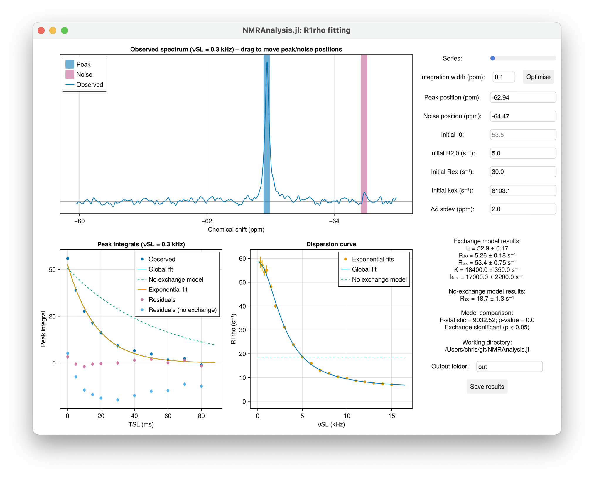

# Tutorial: R1ρ Analysis

This tutorial walks through the graphical interface for analysing R1ρ relaxation dispersion data. It covers GUI controls, fitting workflow, and interpretation of results.

## GUI Overview 

Once launched, the GUI displays the first spectrum of the dataset. 

- **Series Toggle**: Switch between measurements at different spin-lock field strengths.
- **Integration Width**: Manually input a value or click **Optimise** to automatically minimize fitting error.
- **Peak Position (ppm)**: Automatically set to the chemical shift of a ligand; manually adjust accordingly if analsying a mixture.
- **Noise Position (ppm)**: Automatically placed away from the peak; adjust if baseline noise is misestimated.
- **Initial Guesses**: Provide starting values for `R2,0`, `Rex`, and `kex` to guide model fitting.
- **Δδ stdev (ppm)**: Accounts for uncertainty in the chemical shift difference between free and bound states. Assumes a normal distribution centered at 0 ppm with a standard deviation of 2 ppm.
- **Output Folder**: Specify a name for your results folder to keep outputs organised.
- **Save Results**: Export fitted parameters and plots to the output folder.

## Analysis Workflow

### 1. Visualise the Spectrum

- The top panel displays the observed spectrum at a given spin-lock field strength ($ν_{SL}$).
- Peak and noise positions are marked and can be adjusted by dragging.
- Set the **Integration Width** to define the region used for peak fitting.

### 2. Fit the Data

- Click **Optimise** to refine the integration width automatically.
- Input initial guesses for model parameters:
  - `R2,0`: Baseline transverse relaxation rate
  - `Rex`: Exchange contribution to relaxation
  - `kex`: Exchange rate constant
- The GUI fits the data and overlays model curves on the plots.

### 3. Interpret the Results

#### 📊 Peak Integrals

Signal intensities are fit globally as a function of relaxation time and spin-lock field strength:

$$
I(T_{\text{SL}}, \nu_{\text{SL}}) = I_0 \cdot \exp\left(-\left[R_{2,0} + \frac{R_{\text{ex}} \cdot K^2}{K^2 + 4\pi^2 \nu_{\text{SL}}^2}\right] \cdot T_{\text{SL}}\right)
$$

*Adapted from Trott & Palmer (2002), J. Magn. Reson. 154, 157–160.*

Where:

$$
K^2 = k_{\text{ex}}^2 + 4\pi^2 \Delta\nu^2
$$

To assess whether exchange contributes significantly, a null model excluding `Rex` is also fit and compared using an F-test.

#### 📈 Dispersion Curve

The GUI plots $R_{1ρ}$ as a function of $ν_{SL}$ using fitted parameters:

$$
R_{1\rho} = R_{2,0} + \frac{R_{\text{ex}} \cdot K^2}{K^2 + 4\pi^2 \nu_{\text{SL}}^2}
$$

This curve is overlaid with $R_{1ρ}$ values obtained from exponential fits at individual spin-lock field strengths, enabling visual comparison of model performance.

#### 🔁 Kex Correction

To account for uncertainty in the chemical shift difference ($Δδ$), a particle-based Monte Carlo correction is applied to $K$. For each particle, $k_{\text{off}}$ is calculated as:

$$
k_{\text{off}} \approx k_{\text{ex}} = \sqrt{K^2 - 4\pi^2 \Delta\nu^2}
$$

Samples yielding nonphysical values are excluded, and the final estimate is reported as the mean ± standard deviation of valid particles.
